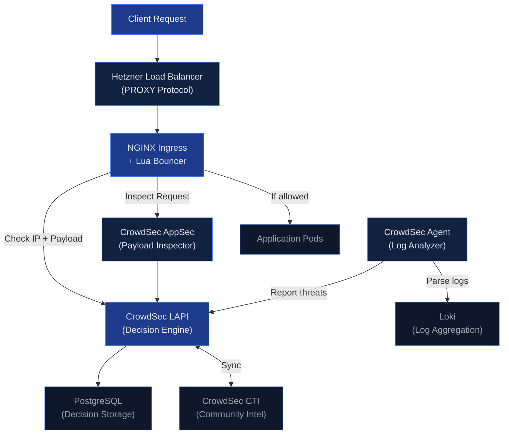

## The Challenge

During a project, certain APIs needed to be accessible without authentication. Public endpoints are inherently vulnerable to SQL injection, brute force attempts, and scanner reconnaissance.

We needed a WAF (Web Application Firewall) solution that could protect these endpoints without the cost of commercial alternatives.

| Aspect | Traditional WAF (CloudFlare, AWS WAF) | CrowdSec |
|--------|---------------------------------------|----------|
| Cost | Expensive (per-request pricing) | Free (open-source) |
| Architecture | Monolithic | Distributed (Detection + Enforcement) |
| Intelligence | Static rules | Community-powered threat feeds |
| Vendor Lock-in | High | None |

CrowdSec won because of its distributed architecture — detection (Agent analyzing logs) and enforcement (Bouncer blocking traffic) are separate components that scale independently.

## Architecture

The target environment was a Kubernetes cluster on Hetzner Cloud:

```
Client → Hetzner Load Balancer → NGINX Ingress → Application Pods
```



**Components:**

- **LAPI (Local API)**: The central brain. Stores ban decisions in PostgreSQL, provides API for bouncers to query, syncs with CrowdSec's community threat intelligence.
- **Agent**: The detective. Reads logs from Loki, parses them, detects attack patterns, and reports malicious IPs to LAPI.
- **AppSec**: The real-time inspector. Analyzes HTTP request payloads for SQL injection, XSS, and other attacks before they reach the application.
- **Bouncer (Lua plugin)**: The security guard. Integrated into NGINX, checks every incoming request against LAPI's ban list.

When a request arrives, the Lua Bouncer checks with LAPI whether the source IP is banned. Simultaneously, AppSec analyzes the request payload for malicious patterns. If either check fails, the request is blocked with a 403 response.


## Implementation

### PostgreSQL Backend with Zalando Operator

CrowdSec's documentation recommends PostgreSQL for production instead of the default SQLite. We used Zalando's postgres-operator:

```yaml
apiVersion: "acid.zalan.do/v1"
kind: postgresql
metadata:
  name: crowdsec-postgres
  namespace: postgres-operator
spec:
  teamId: "crowdsec"
  numberOfInstances: 2
  volume:
    size: 10Gi
  postgresql:
    version: "15"
  preparedDatabases:
    crowdsec:
      defaultUsers: true
      secretNamespace: crowdsec
```

LAPI configuration to use PostgreSQL:

```yaml
config:
  config.yaml.local: |
    db_config:
      type: postgresql
      user: crowdsec_owner_user
      password: "${DB_PASSWORD}"
      db_name: crowdsec
      host: crowdsec-postgres.postgres-operator.svc.cluster.local
      port: 5432
      sslmode: require
```

The password is injected from a Kubernetes Secret created by postgres-operator. One caveat: after switching from SQLite to PostgreSQL, existing machines and bouncers need to re-register. With `auto_registration` enabled, restarting the Agent and AppSec pods handles this automatically.

### Agent Log Collection via Loki

The default CrowdSec Agent deployment uses DaemonSet with hostPath mounts to read container logs. This approach failed — containerd stores logs in paths like `/var/log/pods/<namespace>_<pod-name>_<uid>/<container>/` and the dynamic UID component made pattern matching unreliable.

Since we already had Loki collecting logs, we switched the Agent to use Loki as its datasource:

```yaml
agent:
  isDeployment: true
  hostVarLog: false

  additionalAcquisition:
    - source: loki
      url: "http://loki-distributed-query-frontend.monitoring:3100"
      query: '{namespace="nginx-public", container="controller"}'
      labels:
        type: nginx
        program: nginx
```

| Metric | DaemonSet (Before) | Deployment + Loki (After) |
|--------|-------------------|---------------------------|
| Pod Count | 1 per node (3 total) | 1 fixed |
| CPU Request | 500m x 3 = 1500m | 500m |
| Memory Request | 250Mi x 3 = 750Mi | 250Mi |

67% resource reduction while improving reliability. Loki already aggregates logs from all nodes, so the Agent can analyze everything from a single Deployment.

## Pitfalls We Encountered

### 1. PostgreSQL Cluster Creation Silently Fails

When we created the PostgreSQL CR in the `crowdsec` namespace, the StatefulSet was never created. The operator logs showed:

```
{"cluster-name":"crowdsec/crowdsec-postgres","level":"warning","msg":"defined CPU limit 0 for postgres container is below required minimum"}
```

After this warning, nothing happened. No StatefulSet, no pods. We tried restarting the operator, adding explicit resource limits, adding optional fields — nothing worked.

**Fix**: We moved the PostgreSQL cluster to the `postgres-operator` namespace instead of `crowdsec`. The StatefulSet was created immediately. The `secretNamespace` field ensures the database credentials are still created in the `crowdsec` namespace where LAPI can access them.

The root cause remains unclear — possibly a namespace-specific permission issue with the operator. But moving to the operator's namespace resolved it completely.

### 2. Client IP Showing as Load Balancer Internal IP

After deployment, penetration tests revealed that all detected attacks showed a private IP address — the Hetzner Load Balancer's internal IP, not the actual client IP. CrowdSec was banning the load balancer instead of real attackers.

Our setup used PROXY Protocol:

```yaml
controller:
  config:
    use-proxy-protocol: "true"
  service:
    annotations:
      load-balancer.hetzner.cloud/uses-proxyprotocol: "true"
```

PROXY Protocol was correctly configured, yet the wrong IP appeared in logs.

**Root cause**: We had `use-forwarded-headers: "true"` in our NGINX configuration. Hetzner's Load Balancer was setting `X-Forwarded-For` to its own internal IP. When both PROXY Protocol and `use-forwarded-headers` are enabled, NGINX prioritizes `X-Forwarded-For` over PROXY Protocol.

**Fix**: Remove `use-forwarded-headers` from the configuration. PROXY Protocol alone is sufficient:

```yaml
controller:
  config:
    use-proxy-protocol: "true"
    compute-full-forwarded-for: "true"
    # use-forwarded-headers: removed
```

### 3. hostPath Log Collection Fails with containerd

The default Agent DaemonSet uses wildcard patterns to match container log paths. But containerd stores logs with dynamic UIDs in the path (`/var/log/pods/<namespace>_<pod-name>_<uid>/<container>/`), making pattern matching unreliable.

**Fix**: Switch to Loki datasource as described above. If you already have centralized logging, use it instead of wrestling with container log paths and permissions.

## Verification: Penetration Testing

After resolving all integration challenges, we ran penetration tests to verify the WAF was working correctly.

The security team simulated various attack patterns — SQL injection attempts, directory traversal, and scanner tool signatures. The CrowdSec Console showed actual attacker IPs being detected and banned.

We confirmed that:
- Attack requests were blocked with 403 responses
- Attacker IPs appeared in LAPI's decision list
- Subsequent requests from banned IPs were rejected immediately
- Ban decisions synced to CrowdSec's community blocklist

## Results

**Detection Capabilities**
- SQL injection attempts blocked
- Scanner tools (sqlmap, nikto) detected and banned
- Brute force login attempts throttled
- OWASP Top 10 attack patterns covered via AppSec rules

**Operational Benefits**
- Sub-millisecond decision latency (Lua cache)
- Centralized visibility via CrowdSec Console
- Prometheus metrics for monitoring
- Zero licensing cost

## Key Takeaways

1. **Zalando postgres-operator may have namespace restrictions.** When StatefulSet creation silently fails, try deploying in the `postgres-operator` namespace with `secretNamespace` pointing to your target namespace.

2. **PROXY Protocol and X-Forwarded-For can conflict.** When using PROXY Protocol with cloud load balancers, avoid `use-forwarded-headers: true` — the load balancer's internal IP may override the real client IP.

3. **Loki datasource is simpler than hostPath mounts.** If you already have centralized logging, use it as Agent's datasource instead of wrestling with container log paths and permissions.

4. **PostgreSQL is recommended for production.** SQLite works for testing, but PostgreSQL enables persistent decision storage and horizontal scaling.

## Frequently Asked Questions

### How does CrowdSec compare to ModSecurity?

CrowdSec and ModSecurity serve different purposes. ModSecurity is a traditional WAF engine that applies regex-based rules (like the OWASP Core Rule Set) to each request. CrowdSec combines behavior analysis (detecting attack patterns over time) with real-time payload inspection (AppSec) and community threat intelligence. The key differentiator is the community blocklist — when someone gets banned on one CrowdSec instance, that IP is shared across the network. ModSecurity doesn't have this collaborative dimension.

### What's the performance impact on NGINX?

The Lua Bouncer adds sub-millisecond latency per request. It maintains a local cache of ban decisions, so it doesn't call LAPI on every request. We measured <0.5ms overhead on P99 latency in our load tests with 2,000 RPS. AppSec inspection adds slightly more (~1-2ms) since it analyzes the request payload, but this is still negligible compared to application processing time.

### Can I use CrowdSec without the community blocklist?

Yes. You can run CrowdSec in "standalone" mode without syncing to the community hub. You'll still get local detection and blocking from the parsers and scenarios you configure. However, the community blocklist is one of CrowdSec's strongest features — you benefit from threat intelligence gathered across thousands of installations. There's no downside to enabling it unless you have strict data sovereignty requirements.

### Does CrowdSec support other ingress controllers besides NGINX?

Yes. CrowdSec has bouncers for Traefik, HAProxy, Caddy, and a generic HTTP bouncer that works with any reverse proxy via API calls. The NGINX Lua Bouncer is the most mature and performant option, but the Traefik bouncer (using middleware) is also production-ready. For non-standard setups, the HTTP API bouncer can be integrated with any proxy that supports external auth endpoints.

### How do you handle false positives?

CrowdSec provides a `cscli decisions delete` command to manually unban IPs. For systematic false positives, you can create whitelist parsers or adjust scenario thresholds. The CrowdSec Console provides visibility into all decisions with the triggering scenario, so you can identify patterns. We whitelist our office IP ranges and monitoring endpoints as a baseline, and review new bans weekly during the first month of deployment.
