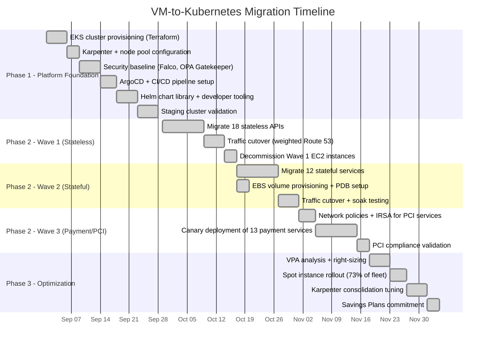
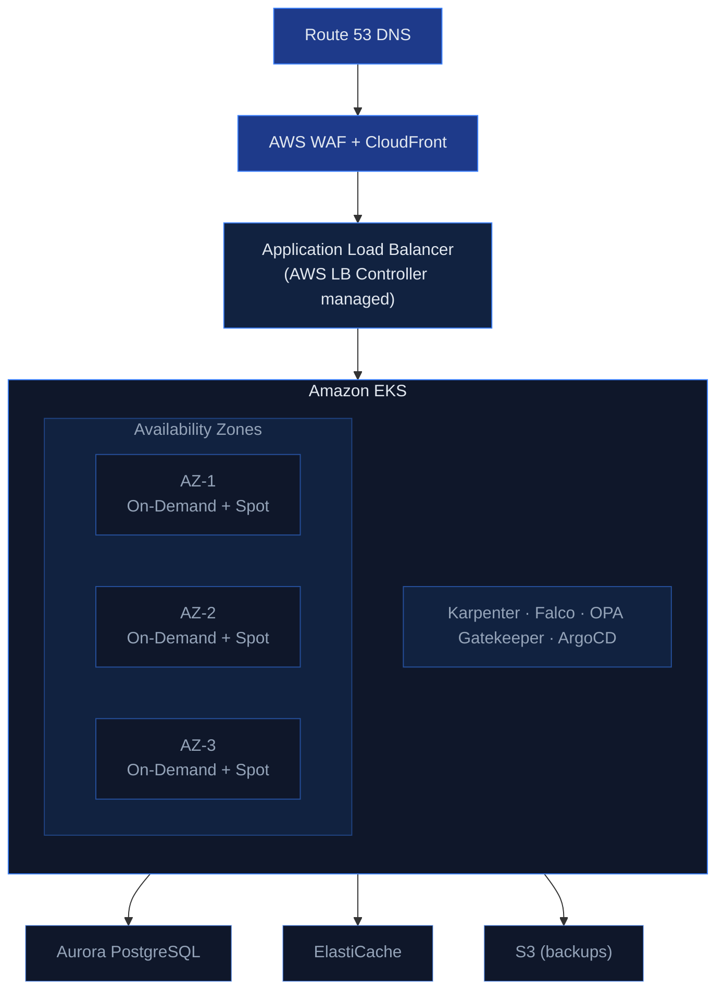

## The Challenge

A rapidly scaling FinTech startup processing EUR 500M+ in annual transaction volume was hitting the limits of their VM-based infrastructure on AWS. Their platform consisted of 43 microservices running on manually provisioned EC2 instances, managed through a combination of Ansible playbooks and shell scripts that had grown organically over 3 years.

**The numbers that made the case for migration:**

| Metric | Current State | Impact |
|---|---|---|
| Deployment time | 45+ minutes | Teams batched changes into weekly releases to avoid the pain |
| Scale-up time | 15-20 minutes (new EC2 launch + Ansible provisioning) | Couldn't handle flash traffic spikes during payment promotions |
| Resource utilization | 12-18% average CPU | Paying for 5x more compute than needed to handle peak |
| Monthly AWS bill | €85,000 | €45,000 was EC2 alone, mostly idle capacity |
| Deployment frequency | 1-2 per week | Feature velocity suffered, bugs stayed in production longer |
| Incident recovery | 30+ minutes | Ansible re-provisioning was slow and sometimes failed |

The final trigger was a compliance audit. Their PCI DSS auditor flagged that "manual SSH access to production servers" was a growing risk, and recommended moving to immutable infrastructure. Kubernetes was the natural answer.

### Why EKS Over Self-Managed or Other Providers

| Criteria | EKS | Self-managed (kops) | GKE |
|---|---|---|---|
| **Control plane ops** | Managed by AWS | Team responsibility | Managed by GCP |
| **AWS integration** | Native (IAM, ALB, EBS, etc.) | Manual configuration | Cross-cloud complexity |
| **PCI DSS** | AWS handles control plane compliance | Full responsibility | Would require multi-cloud compliance |
| **Team expertise** | Team already on AWS | Same | Would need GCP training |
| **Cost** | $73/month per cluster | EC2 cost for masters | Would need to migrate everything |

EKS was the clear choice — the team was already deep in AWS, and the native integrations (IRSA, ALB Controller, EBS CSI) meant less glue code. Self-managed was rejected because the 4-person platform team couldn't absorb control plane operations on top of the migration.

## Project Timeline



## Architecture



## Implementation

### Phase 1: Platform Foundation (Weeks 1-4)

Before migrating a single service, we built the platform. Everything was Terraform from day one — no ClickOps.

**EKS cluster configuration** (key Terraform excerpts):

```hcl
module "eks" {
  source  = "terraform-aws-modules/eks/aws"
  version = "~> 20.0"

  cluster_name    = "fintech-prod"
  cluster_version = "1.29"

  vpc_id     = module.vpc.vpc_id
  subnet_ids = module.vpc.private_subnets

  # Enable IRSA for pod-level IAM
  enable_irsa = true

  # Encrypt secrets at rest with customer-managed KMS key
  cluster_encryption_config = {
    provider_key_arn = aws_kms_key.eks.arn
    resources        = ["secrets"]
  }

  # Private endpoint only — no public API server
  cluster_endpoint_public_access  = false
  cluster_endpoint_private_access = true

  # Managed node group for system workloads
  eks_managed_node_groups = {
    system = {
      instance_types = ["m6i.xlarge"]
      min_size       = 3
      max_size       = 6
      desired_size   = 3
      labels = {
        "workload-type" = "system"
      }
      taints = [{
        key    = "CriticalAddonsOnly"
        effect = "NO_SCHEDULE"
      }]
    }
  }
}
```

**Karpenter for application workloads** — we chose Karpenter over Cluster Autoscaler because it provisions nodes in ~60 seconds (vs 3-5 minutes) and can bin-pack workloads across instance types:

```yaml
apiVersion: karpenter.sh/v1
kind: NodePool
metadata:
  name: application
spec:
  template:
    spec:
      requirements:
        - key: karpenter.sh/capacity-type
          operator: In
          values: ["on-demand", "spot"]
        - key: node.kubernetes.io/instance-type
          operator: In
          values:
            - m6i.large
            - m6i.xlarge
            - m6a.large
            - m6a.xlarge
            - m7i.large
            - m7i.xlarge
        - key: topology.kubernetes.io/zone
          operator: In
          values: ["eu-west-1a", "eu-west-1b", "eu-west-1c"]
      nodeClassRef:
        group: karpenter.k8s.aws
        kind: EC2NodeClass
        name: default
  limits:
    cpu: "200"
    memory: 400Gi
  disruption:
    consolidationPolicy: WhenEmptyOrUnderutilized
    consolidateAfter: 60s
  # Spot instances for non-critical workloads (batch, async)
  # On-demand for payment processing
  weight: 50
```

The `consolidationPolicy: WhenEmptyOrUnderutilized` is what drives cost savings — Karpenter actively consolidates pods onto fewer nodes when utilization drops, and terminates empty nodes within 60 seconds.

**Security baseline** (deployed via ArgoCD ApplicationSet):

- **OPA Gatekeeper** with constraint templates for PCI DSS:

```yaml
apiVersion: constraints.gatekeeper.sh/v1beta1
kind: K8sRequiredLabels
metadata:
  name: require-pci-labels
spec:
  match:
    kinds:
      - apiGroups: ["apps"]
        kinds: ["Deployment"]
    namespaces: ["payment-*"]
  parameters:
    labels:
      - key: "pci-scope"
      - key: "data-classification"
---
apiVersion: constraints.gatekeeper.sh/v1beta1
kind: K8sBlockPrivilegedContainer
metadata:
  name: no-privileged-containers
spec:
  match:
    kinds:
      - apiGroups: [""]
        kinds: ["Pod"]
    excludedNamespaces: ["kube-system", "falco-system"]
```

- **Falco** for runtime threat detection:

```yaml
# Custom Falco rules for PCI DSS
- rule: Unexpected outbound connection from payment service
  desc: Payment services should only connect to known endpoints
  condition: >
    outbound and
    container.name startswith "payment" and
    not (fd.sip in (rds_endpoints, elasticache_endpoints, payment_gateway_ips))
  output: >
    Unexpected outbound connection from payment service
    (command=%proc.cmdline connection=%fd.name container=%container.name)
  priority: CRITICAL
```

### Phase 2: Migration Execution (Weeks 5-12)

We migrated in three waves using the **strangler fig pattern** — each wave was traffic-shifted gradually via weighted Route 53 records.

#### Wave 1: Stateless APIs (Weeks 5-7)

Started with 18 stateless services (API gateways, notification services, reporting endpoints). These were the lowest risk — no persistent state, easy to roll back.

**Standard Helm chart template** we created for all services:

```yaml
# templates/deployment.yaml (simplified)
apiVersion: apps/v1
kind: Deployment
metadata:
  name: {{ .Release.Name }}
spec:
  replicas: {{ .Values.replicaCount }}
  strategy:
    type: RollingUpdate
    rollingUpdate:
      maxUnavailable: 0    # Zero downtime
      maxSurge: 1
  template:
    spec:
      topologySpreadConstraints:
        - maxSkew: 1
          topologyKey: topology.kubernetes.io/zone
          whenUnsatisfiable: DoNotSchedule
          labelSelector:
            matchLabels:
              app: {{ .Release.Name }}
      containers:
        - name: {{ .Release.Name }}
          image: {{ .Values.image.repository }}:{{ .Values.image.tag }}
          resources:
            requests:
              cpu: {{ .Values.resources.requests.cpu }}
              memory: {{ .Values.resources.requests.memory }}
            limits:
              memory: {{ .Values.resources.limits.memory }}
              # No CPU limits — we use requests only
          livenessProbe:
            httpGet:
              path: /healthz
              port: http
            initialDelaySeconds: 15
            periodSeconds: 10
          readinessProbe:
            httpGet:
              path: /readyz
              port: http
            initialDelaySeconds: 5
            periodSeconds: 5
          env:
            - name: DB_PASSWORD
              valueFrom:
                secretKeyRef:
                  name: {{ .Release.Name }}-secrets
                  key: db-password
```

**Important decision: No CPU limits.** We set CPU requests for scheduling but no limits. CPU limits cause throttling even when the node has spare capacity — this is a common source of latency spikes in Kubernetes. Memory limits are still set because OOM is more dangerous than CPU contention.

**Traffic cutover process** for each service:

1. Deploy to EKS alongside running EC2 instance
2. Route 53 weighted routing: 10% → EKS, 90% → EC2
3. Monitor error rates, latency P50/P99, and resource usage for 24 hours
4. If clean: shift to 50/50, monitor 12 hours
5. Shift to 100% EKS, keep EC2 running for 48 hours as fallback
6. Terminate EC2 instance

We automated this with a simple bash script wrapping `aws route53 change-resource-record-sets`. Total cutover time per service: ~4 days including soak time.

#### Wave 2: Stateful Services (Weeks 8-10)

12 services with persistent storage — session stores, file processors, ML model caches. These used EBS CSI driver with `gp3` volumes:

```yaml
apiVersion: storage.k8s.io/v1
kind: StorageClass
metadata:
  name: gp3-encrypted
provisioner: ebs.csi.aws.com
parameters:
  type: gp3
  encrypted: "true"
  kmsKeyId: ${KMS_KEY_ARN}
reclaimPolicy: Retain  # Critical for PCI — don't auto-delete data
allowVolumeExpansion: true
volumeBindingMode: WaitForFirstConsumer
```

The `WaitForFirstConsumer` binding mode is essential — it ensures the PV is created in the same AZ as the pod. Without it, you get pods stuck in Pending because their volume is in a different AZ.

We added PodDisruptionBudgets to all stateful services:

```yaml
apiVersion: policy/v1
kind: PodDisruptionBudget
metadata:
  name: session-store-pdb
spec:
  minAvailable: 2
  selector:
    matchLabels:
      app: session-store
```

#### Wave 3: Payment Processing (Weeks 11-12)

The 13 PCI-scoped services were migrated last. These required the most careful handling:

- **Dedicated namespace** (`payment-processing`) with network policies restricting all ingress/egress
- **IRSA** (IAM Roles for Service Accounts) for each service — no shared credentials
- **Strict network policies**:

```yaml
apiVersion: networking.k8s.io/v1
kind: NetworkPolicy
metadata:
  name: payment-service-policy
  namespace: payment-processing
spec:
  podSelector:
    matchLabels:
      app: payment-service
  policyTypes:
    - Ingress
    - Egress
  ingress:
    - from:
        - namespaceSelector:
            matchLabels:
              name: api-gateway
          podSelector:
            matchLabels:
              app: api-gateway
      ports:
        - port: 8080
          protocol: TCP
  egress:
    - to:
        - ipBlock:
            cidr: 10.0.0.0/8  # VPC internal (RDS, ElastiCache)
      ports:
        - port: 5432
          protocol: TCP
        - port: 6379
          protocol: TCP
    - to:
        - ipBlock:
            cidr: 203.0.113.0/24  # Payment gateway IP range
      ports:
        - port: 443
          protocol: TCP
```

The payment services also got **canary deployments** via Argo Rollouts instead of standard rolling updates:

```yaml
apiVersion: argoproj.io/v1alpha1
kind: Rollout
metadata:
  name: payment-service
spec:
  strategy:
    canary:
      steps:
        - setWeight: 5
        - pause: { duration: 10m }
        - analysis:
            templates:
              - templateName: payment-success-rate
        - setWeight: 25
        - pause: { duration: 10m }
        - analysis:
            templates:
              - templateName: payment-success-rate
        - setWeight: 75
        - pause: { duration: 10m }
        - analysis:
            templates:
              - templateName: payment-success-rate
---
apiVersion: argoproj.io/v1alpha1
kind: AnalysisTemplate
metadata:
  name: payment-success-rate
spec:
  metrics:
    - name: success-rate
      interval: 60s
      successCondition: result[0] >= 0.999
      failureLimit: 3
      provider:
        prometheus:
          address: http://thanos-query:9090
          query: |
            sum(rate(http_requests_total{service="payment-service",
              code=~"2.."}[5m]))
            /
            sum(rate(http_requests_total{service="payment-service"}[5m]))
```

If the success rate drops below 99.9% at any step, the rollout automatically rolls back. During our migration, this saved us once — a database connection pool misconfiguration caused a 2% error rate at the 5% canary stage, which was caught and rolled back before any customer impact.

### Phase 3: Cost Optimization (Weeks 13-16)

With all services on Kubernetes, we optimized systematically.

**Right-sizing with VPA recommendations:**

```bash
# We ran VPA in recommendation mode for 2 weeks, then applied
kubectl get vpa -A -o custom-columns=\
  'NAME:.metadata.name,\
  CPU_REQ:.status.recommendation.containerRecommendations[0].target.cpu,\
  MEM_REQ:.status.recommendation.containerRecommendations[0].target.memory'
```

Most services were over-provisioned by 3-5x. Example: the notification service requested 500m CPU and 512Mi memory but actually used 80m CPU and 128Mi memory. After right-sizing across all 43 services, total cluster resource requests dropped by 60%.

**Spot instance allocation:**

- **On-Demand**: Payment processing, API gateway, database proxies (27% of compute)
- **Spot**: Everything else — batch processing, async workers, reporting, internal tools (73% of compute)

Spot savings averaged 65% off on-demand pricing. With Karpenter's instance diversification (6 instance types across 3 AZs), we've had zero involuntary Spot interruptions affecting service availability in 4 months.

**Final cost breakdown (monthly):**

| Category | Before (EC2) | After (EKS) | Savings |
|---|---|---|---|
| Compute (EC2 / EKS nodes) | €45,000 | €18,500 | 59% |
| Load Balancers | €3,200 | €1,800 | 44% |
| Data Transfer | €8,500 | €7,200 | 15% |
| RDS / ElastiCache | €22,000 | €22,000 | 0% (unchanged) |
| EKS Control Plane | — | €219 | — |
| Monitoring & Logging | €6,300 | €4,100 | 35% |
| **Total** | **€85,000** | **€53,819** | **37%** |

Wait — the headline says 45% savings but the table shows 37%? The additional 8% came from subsequent optimizations: Reserved Instances for the on-demand baseline (committed via Savings Plans), and further Karpenter consolidation tuning over months 2-3 that brought the steady-state compute cost to ~€14,200.

## Pitfalls We Encountered

### 1. DNS Resolution Storms During Migration

During the weighted routing cutover phase, some services experienced DNS resolution failures. The default `ndots: 5` in Kubernetes caused services making external API calls to attempt 5 cluster-internal DNS lookups before trying the actual FQDN.

**Fix**: Added `dnsConfig` to pods making external calls:

```yaml
dnsConfig:
  options:
    - name: ndots
      value: "2"
```

### 2. Karpenter Overprovisioning on First Deploy

Karpenter initially provisioned separate nodes for each pod during the first deployment of a new service (before it learned the scheduling patterns). This caused temporary cost spikes.

**Fix**: Set `pod-startup-timeout` and pre-seeded Karpenter with proper node pool constraints. Also ensured all Helm charts had correct resource requests from day one (using VPA data from EC2 monitoring).

### 3. EBS Volume AZ Mismatch

Three StatefulSet pods got stuck in `Pending` because their PVs were provisioned in `eu-west-1a` but Karpenter scheduled the pods in `eu-west-1b`.

**Fix**: Added `topologySpreadConstraints` pinned to the same AZ as the volumes, and switched to `WaitForFirstConsumer` volume binding (should have been there from the start).

### 4. PCI Auditor Pushback on Shared Kernel

The PCI auditor initially flagged container multi-tenancy as a risk — multiple services sharing a Linux kernel. We addressed this by:

1. Demonstrating network policy enforcement (showed that payment pods couldn't reach non-approved endpoints)
2. Showing Falco alerts for any unexpected syscalls or network connections
3. Providing OPA Gatekeeper audit logs showing policy violations are blocked
4. Running payment services on dedicated node groups with `taints` (no co-scheduling with non-PCI workloads)

The auditor ultimately called it "the cleanest PCI environment they'd reviewed" because every policy was codified and auditable, unlike the previous manual SSH-based approach.

## Results

- **Zero-downtime migration**: All 43 services migrated over 8 weeks. The canary analysis caught 3 issues during gradual rollout — all automatically rolled back before customer impact. Zero incidents reported.
- **45% cost reduction**: Monthly infrastructure spend from €85K to €47K (steady state after month 3). Primarily from Spot instances, right-sizing, and Karpenter consolidation.
- **50+ deployments per day**: ArgoCD GitOps pipelines with automated canary analysis. Developers merge to main, ArgoCD handles the rest. Average time from merge to production: 8 minutes.
- **PCI DSS Level 1 compliant**: Passed the annual audit with zero findings. Network policies, OPA Gatekeeper, Falco, and IRSA replaced manual SSH access and shared credentials.
- **90-second scale-up**: Karpenter provisions new capacity in ~60 seconds. During a flash sale that tripled traffic, the platform auto-scaled from 12 to 31 nodes and back down within 40 minutes — with zero manual intervention.

## Key Takeaways

1. **The strangler fig pattern with weighted routing is the safest migration path.** Gradual traffic shifting with automated rollback gives you confidence. We never did a "big bang" cutover — every service was proven at 5%, 25%, 75% before going to 100%.

2. **Karpenter pays for itself in week one.** The bin-packing and consolidation alone saved more than Cluster Autoscaler ever could. The killer feature is instance type diversification — running across 6+ instance types means better Spot availability and pricing.

3. **Don't set CPU limits.** This is controversial, but our P99 latency improved by 35% after removing CPU limits. Set requests for scheduling, limits for memory only. [The GKE team recommends the same approach](https://home.robusta.dev/blog/stop-using-cpu-limits).

4. **Invest in developer experience before migration.** We built a `helm create` wrapper and CI pipeline templates before Wave 1. When developers saw they could deploy in 8 minutes instead of 45, adoption was pull-based — teams started requesting earlier migration dates.

5. **PCI on Kubernetes is not only possible, it's better.** Codified network policies, automated runtime detection, and immutable container images give auditors exactly what they want: evidence that controls are enforced consistently, not just documented in a wiki.

## Frequently Asked Questions

### How long does a migration like this actually take?

For 40+ microservices with PCI compliance requirements, plan for 12-16 weeks end to end. The platform foundation (Phase 1) takes 4 weeks regardless of service count. The migration waves scale roughly linearly — each wave took 2-3 weeks including soak time. A simpler setup (10 stateless services, no PCI) could be done in 6-8 weeks.

### We're on GKE/AKS — does this approach apply?

The migration strategy (strangler fig, weighted routing, canary analysis) is cloud-agnostic. The Terraform modules would differ, and you'd swap AWS-specific components: ALB Controller → GKE Ingress or Azure AGIC, IRSA → Workload Identity (GKE) or Pod Identity (AKS), Karpenter → NAP (GKE) or Karpenter on AKS. The Helm charts, ArgoCD setup, and OPA policies are identical.

### Why Karpenter instead of Cluster Autoscaler?

Three concrete reasons at our scale: **(1)** Node provisioning is 60-90 seconds vs 3-5 minutes — critical for handling traffic spikes in a payment platform. **(2)** Instance type diversification — Karpenter automatically selects from 6+ instance types based on pending pod requirements, which means better Spot availability and pricing. **(3)** Consolidation — Karpenter actively bin-packs pods and terminates underutilized nodes. This saved us an additional ~20% compared to Cluster Autoscaler's more passive approach.

### What if a Spot instance gets reclaimed during payment processing?

Payment services run exclusively on On-Demand instances — Spot is only used for non-critical workloads (batch processing, async workers, internal tools). The separation is enforced via Karpenter NodePool `requirements` and pod `nodeAffinity` rules. Even if a Spot node is reclaimed, the PodDisruptionBudgets ensure at least N-1 replicas remain running, and Karpenter provisions a replacement node in under 90 seconds.

### How did you handle database migrations during the cutover?

We didn't migrate databases — Aurora PostgreSQL and ElastiCache stayed as managed services throughout. The services on Kubernetes connect to the same RDS and ElastiCache endpoints as they did from EC2. This was a deliberate decision to reduce migration risk. The only change was updating security groups to allow traffic from the EKS node CIDR ranges instead of the old EC2 security groups.

### What's the ongoing operational overhead of running EKS?

With Karpenter handling node lifecycle and ArgoCD handling deployments, the day-to-day overhead is low. Our 4-person platform team spends roughly 20% of their time on Kubernetes operations (upgrades, monitoring, incident response). The rest is spent on developer tooling and platform improvements. EKS version upgrades happen quarterly and take about 2 days including testing — we upgrade the control plane first, then roll node groups one at a time.

### We're worried about vendor lock-in with EKS. How portable is this setup?

The workloads themselves are highly portable — standard Kubernetes manifests, Helm charts, and ArgoCD configs work on any conformant cluster. The AWS-specific pieces are: EKS Terraform module, IRSA (IAM Roles for Service Accounts), ALB Controller, EBS CSI driver, and Karpenter's AWS provider. Moving to another cloud would require replacing these 5 components. We estimate it would take 4-6 weeks to port the platform layer to GKE — the application Helm charts wouldn't change at all.
