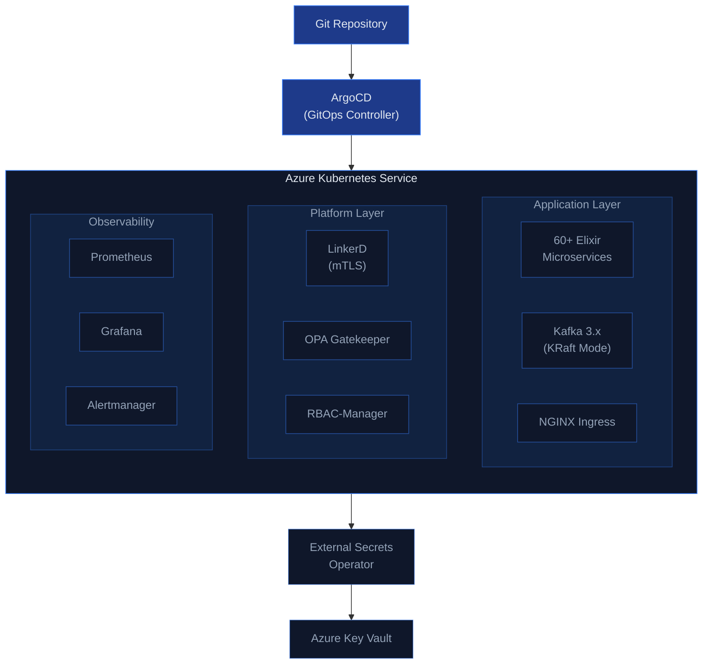

## The Challenge

Migrating Apache Kafka from Virtual Machines to Kubernetes sounds straightforward on paper. In practice, it's one of the most complex infrastructure transformations an enterprise team can undertake.

Over the course of several months, we migrated a production Kafka cluster — along with 60+ Elixir microservices, NGINX reverse proxies, and an entire Ansible-managed infrastructure — into Azure Kubernetes Service (AKS). The project touched every layer of the stack: networking, security, secrets management, observability, and deployment workflows.

**The legacy pain points:**

| Problem | Impact |
|---|---|
| Manual scaling with no auto-recovery | Extended outages during traffic spikes |
| Ansible configuration drift across environments | "Works on staging, breaks on prod" |
| Secrets stored in configuration files | Security audit failures |
| No centralized observability | Blind spots during incident response |
| Growing VM patching burden | 30%+ of team time on maintenance |
| Environment inconsistency | Dev/staging/production divergence |

The organization needed a Kubernetes-native architecture that would eliminate operational overhead while improving security and reliability.

## Target Architecture

Our target architecture was designed around five principles: everything declarative, everything automated, everything observable, everything secure, and everything reproducible.



**Key architectural decisions:**

- **Infrastructure Layer:** Terraform and Terragrunt modules provisioned the entire Azure environment — AKS clusters, networking, Key Vault, storage, and monitoring resources. Every infrastructure change went through pull requests and was applied via CI/CD pipelines.
- **GitOps Deployment:** ArgoCD became the single deployment mechanism. No engineer needed kubectl access to production.
- **Kafka on KRaft:** We migrated from Kafka 2.x with Zookeeper to Kafka 3.x with KRaft — Kafka's built-in consensus mechanism that eliminates the Zookeeper dependency entirely. Fewer components, fewer failure modes, simpler scaling.
- **Zero-Trust Networking:** LinkerD provided a service mesh with mutual TLS (mTLS) between all services. Combined with OPA Gatekeeper for policy enforcement and RBAC-Manager for fine-grained access control.
- **Observability:** Prometheus, Grafana, and Alertmanager provided metrics and alerting. Custom dashboards for Kafka-specific metrics — consumer lag, partition distribution, broker health.

## Implementation

### Containerizing Elixir Services

Elixir runs on the BEAM virtual machine, which has its own clustering and node discovery mechanism. In a VM world, nodes find each other via static IP addresses. In Kubernetes, pods are ephemeral — IPs change, containers restart, and scaling happens dynamically.

We implemented Kubernetes-native service discovery for BEAM clustering using custom `libcluster` configurations:

```elixir
# config/releases.exs
config :libcluster,
  topologies: [
    k8s: [
      strategy: Cluster.Strategy.Kubernetes.DNS,
      config: [
        service: "elixir-nodes-headless",
        application_name: "my_app",
        polling_interval: 5_000
      ]
    ]
  ]
```

This required building GitHub Actions workflows specifically for the Elixir/Phoenix ecosystem — off-the-shelf Docker images and CI templates didn't exist for our use case.

### Kafka Data Migration with MirrorMaker2

You can't just "move" a Kafka cluster. Kafka stores data with consumer offsets, topic partition configurations, and retention policies that matter.

We used MirrorMaker2 to replicate data between the VM-based Kafka cluster and the new Kubernetes-based cluster:

```yaml
apiVersion: kafka.strimzi.io/v1beta2
kind: KafkaMirrorMaker2
metadata:
  name: vm-to-k8s-mirror
spec:
  version: 3.6.0
  replicas: 3
  connectCluster: "target"
  clusters:
    - alias: "source"
      bootstrapServers: kafka-vm-1:9092,kafka-vm-2:9092,kafka-vm-3:9092
    - alias: "target"
      bootstrapServers: kafka-kraft-bootstrap:9092
  mirrors:
    - sourceCluster: "source"
      targetCluster: "target"
      sourceConnector:
        config:
          replication.factor: 3
          offset-syncs.topic.replication.factor: 3
          sync.topic.acls.enabled: "false"
          replication.policy.class: "org.apache.kafka.connect.mirror.IdentityReplicationPolicy"
      checkpointConnector:
        config:
          checkpoints.topic.replication.factor: 3
          sync.group.offsets.enabled: "true"
      topicsPattern: ".*"
```

This allowed us to run both clusters in parallel, migrate consumers gradually, and validate data integrity before cutting over. The zero-downtime requirement made this non-negotiable.

### Secrets Migration to Azure Key Vault

The legacy setup stored secrets in Ansible-managed configuration files and environment variables on VMs. The target was External Secrets Operator integrated with Azure Key Vault.

```yaml
apiVersion: external-secrets.io/v1beta1
kind: ExternalSecret
metadata:
  name: kafka-credentials
spec:
  refreshInterval: 1h
  secretStoreRef:
    name: azure-keyvault
    kind: ClusterSecretStore
  target:
    name: kafka-credentials
    creationPolicy: Owner
  data:
    - secretKey: kafka-password
      remoteRef:
        key: kafka-broker-password
    - secretKey: truststore-password
      remoteRef:
        key: kafka-truststore-password
```

The challenge was the migration itself: identifying every secret across 60+ services, mapping them to Key Vault entries, configuring External Secrets for each namespace, and testing that every service could retrieve its secrets correctly. Edge cases appeared constantly — services reading secrets from files vs. environment variables, secrets with special characters that needed encoding, and cross-service secrets that had to be synchronized.

This alone was a 3-week effort.

### mTLS with LinkerD

Introducing LinkerD for service mesh encryption was a security win but an operational challenge. MQTT and AMQP messaging infrastructure — which several microservices depended on — had protocol-level conflicts with mTLS proxy injection.

LinkerD's sidecar proxy intercepts TCP connections, but MQTT and AMQP have their own connection semantics that don't play well with transparent proxying. We had to carefully configure protocol detection, skip lists, and custom annotations:

```yaml
# For services that use MQTT/AMQP
metadata:
  annotations:
    linkerd.io/inject: enabled
    config.linkerd.io/skip-outbound-ports: "1883,5672,5671"
    config.linkerd.io/opaque-ports: "1883,5672"
```

This ensured messaging infrastructure remained functional while still benefiting from mTLS on HTTP-based services.

## Pitfalls We Encountered

### 1. Ansible Doesn't Die Easily

We underestimated how long it takes to fully decommission an Ansible-based infrastructure. Ansible wasn't just managing Kafka — it managed NGINX configurations, system packages, user accounts, firewall rules, monitoring agents, and log rotation.

Each of these responsibilities had to be replaced with a Kubernetes-native equivalent:

| Ansible Responsibility | Kubernetes Replacement |
|---|---|
| NGINX configuration | NGINX Ingress Controller |
| TLS certificate management | cert-manager |
| VM-level backups | Velero |
| Firewall rules | NetworkPolicies |
| Monitoring agents | Prometheus ServiceMonitors |
| Log rotation | Loki + Promtail |

The decommissioning phase took longer than the Kubernetes migration itself. Legacy tooling has gravitational pull — every time you think you've removed the last dependency, another playbook surfaces.

### 2. KRaft in Production Was Still New

The transition from Zookeeper to KRaft added another layer of complexity. KRaft was still relatively new in production environments, and we spent significant time validating its behavior under our specific workload patterns — particularly around partition rebalancing and controller failover scenarios.

### 3. BEAM Clustering in Kubernetes

The BEAM VM's native clustering expects stable network identities. Kubernetes pod churn (scaling events, rolling updates, node drains) caused cluster membership changes that triggered expensive state synchronization. We had to tune `libcluster` polling intervals and implement graceful handoff mechanisms for stateful GenServer processes.

## Results

The migration delivered on every objective:

- **Fully automated GitOps deployments** replaced manual Ansible runs
- **Self-healing Kubernetes pods** replaced static VM configurations
- **Centralized secrets management** replaced scattered configuration files
- **Zero-trust mTLS networking** replaced flat VM networks
- **Comprehensive observability** replaced blind spots
- **Multi-environment consistency** replaced environment drift

The operations team went from spending 30%+ of their week on manual maintenance to focusing on platform improvements. Environment provisioning dropped from weeks to minutes. The security posture improved dramatically — passing penetration tests that would have been challenging in the VM-based setup.

## Key Takeaways

1. **Start with MirrorMaker2 early.** Data migration is the constraint that defines your timeline, not the infrastructure migration.

2. **Don't underestimate the Ansible decommission.** Budget as much time for removing the old infrastructure as building the new one.

3. **Test mTLS with your actual protocols.** Not everything is HTTP, and service mesh proxies make assumptions about traffic patterns.

4. **Secrets migration is a project in itself.** Audit every secret before you start, not during the migration.

5. **Containerize a few services first.** Don't try to move 60+ services at once — start with 3-5, learn from the pain, and then scale the process.

## Frequently Asked Questions

### How long does a Kafka migration like this take?

Plan for 3-6 months depending on the number of services and topics. The MirrorMaker2 data replication is the longest pole — allow at least 2 weeks of parallel running for data integrity validation before cutting consumers over. The infrastructure (AKS, Terraform, ArgoCD) can be ready in 2-3 weeks; the migration execution is what takes time.

### Why KRaft over keeping Zookeeper?

KRaft eliminates an entire operational surface area. With Zookeeper, you're running a separate 3-node quorum that needs its own monitoring, backup, and upgrade cycle. KRaft consolidates metadata management into the Kafka brokers themselves. Fewer components = fewer failure modes. We also saw faster partition rebalancing and controller elections compared to our Zookeeper setup.

### Can I migrate Kafka without MirrorMaker2?

If you can tolerate downtime, yes — stop producers, copy data files, restart on the new cluster. For zero-downtime requirements (which most production systems have), MirrorMaker2 is the only supported approach. It handles topic replication, consumer offset synchronization, and ACL mirroring. The `IdentityReplicationPolicy` ensures topic names stay the same, so consumers don't need reconfiguration.

### What about Strimzi vs Confluent Operator for Kafka on Kubernetes?

We used Strimzi — it's open-source, CNCF sandbox, and provides full lifecycle management for Kafka on Kubernetes. Confluent Operator is more feature-rich (schema registry, ksqlDB management) but requires a Confluent Platform license for production use. If you only need Kafka brokers + Connect + MirrorMaker2, Strimzi does everything you need at zero licensing cost.

### How did you handle the Elixir release process?

Each Elixir service got a multi-stage Dockerfile: compile in an Elixir builder image, then copy the release into a minimal Alpine runtime image. We used `mix release` for building self-contained releases. The CI pipeline runs `mix test`, builds the Docker image, pushes to ACR, and ArgoCD picks up the new image tag from the Helm chart values. Average build time: ~4 minutes per service.

### What's the ongoing cost difference?

The VM infrastructure required dedicated machines for Kafka brokers (3), Zookeeper (3), NGINX (2), plus the application VMs. On AKS with autoscaling, we consolidated everything onto a shared node pool that scales based on actual demand. The exact savings depend on your workload patterns, but we saw significant cost reduction from eliminating the always-on dedicated VMs that were provisioned for peak capacity.
