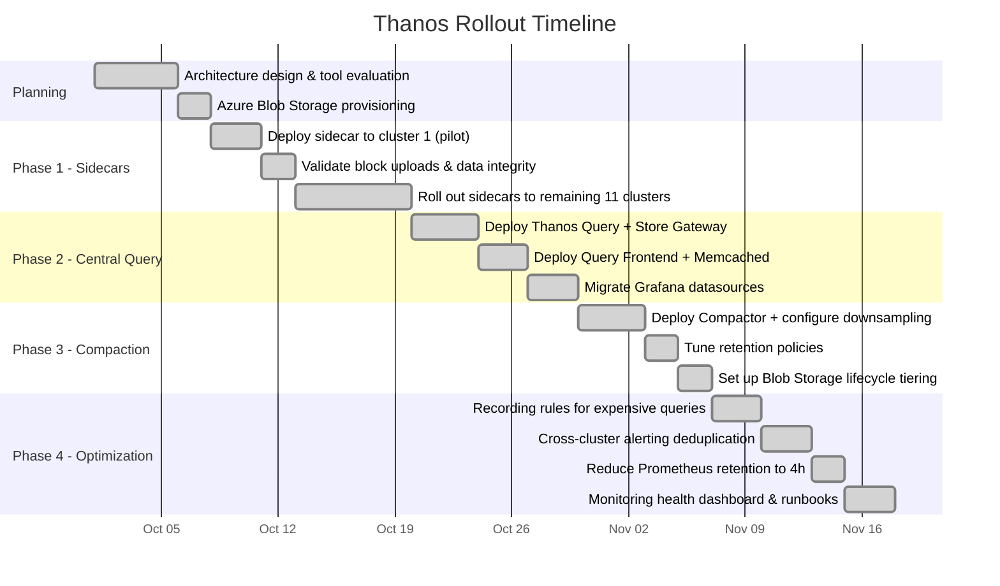
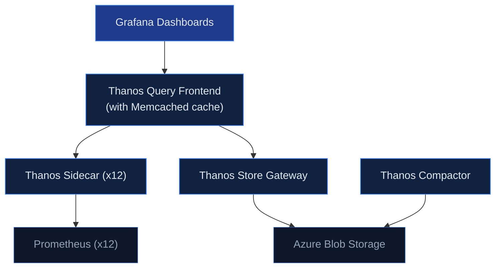

## The Challenge

Our client, a fast-growing e-commerce platform processing over 2 million orders per day, was struggling with fragmented monitoring across their 12 Azure Kubernetes Service (AKS) clusters spread across 3 Azure regions (West Europe, North Europe, East US).

Each cluster ran its own standalone Prometheus instance with the default 15-day retention. On-call engineers had to SSH into individual clusters and port-forward to each Prometheus to investigate incidents. During Black Friday 2025, a cascading failure took 23 minutes longer to diagnose than necessary — simply because the team couldn't correlate metrics across clusters.

**Key pain points:**

- **No cross-cluster visibility**: Investigating a checkout failure required manually checking 4 different Prometheus instances. Engineers had 12 Grafana bookmarks.
- **Spiraling storage costs**: Each Prometheus instance used Premium SSD-backed persistent volumes. At ~40GB per instance, that's 480GB of premium SSD across the fleet — roughly €1,200/month just for metric storage.
- **No capacity planning**: With only 15 days of data, questions like "What was our peak CPU usage during last quarter's sale?" were unanswerable.
- **Alert fatigue**: Each cluster had independently maintained alerting rules. Some clusters had 200+ rules, others had 40. Duplicate alerts fired simultaneously across clusters during cross-region incidents.

### Why Thanos Over Alternatives

We evaluated three options:

| Criteria | Thanos | Cortex | Grafana Mimir |
|---|---|---|---|
| **Deployment complexity** | Low — sidecar model extends existing Prometheus | High — requires Consul/etcd, multiple ring components | Medium — simpler than Cortex but still requires dedicated cluster |
| **Migration effort** | Minimal — no data migration, sidecar attaches to existing Prometheus | High — must rewrite remote_write configs, migrate data | Medium — remote_write based |
| **Cost (at our scale)** | ~€200/month (Blob Storage + compute) | ~€600/month (dedicated cluster + storage) | ~€450/month (dedicated cluster) |
| **Community maturity** | CNCF Incubating, battle-tested at scale | CNCF, backed by Grafana Labs | Newer, less production mileage |

Thanos won because of its **non-invasive sidecar approach** — we could roll it out cluster by cluster without changing existing Prometheus configurations or risking data loss.

## Project Timeline



## Architecture



## Implementation

### Phase 1: Sidecar Deployment (Week 1-2)

The sidecar pattern is the least invasive way to integrate Thanos. We added the Thanos sidecar as a container in the existing Prometheus StatefulSet — no data migration, no downtime.

Here's the core Helm values we used for the `kube-prometheus-stack` chart to enable the Thanos sidecar:

```yaml
# values-thanos-sidecar.yaml
prometheus:
  prometheusSpec:
    replicas: 2 # HA pair per cluster
    retention: 4h # Reduced — Thanos handles long-term
    retentionSize: "10GB"
    thanos:
      objectStorageConfig:
        existingSecret:
          name: thanos-objstore-config
          key: objstore.yml
      # Sidecar will upload blocks every 2h
      blockDuration: 2h
    externalLabels:
      cluster: "{{ .Values.clusterName }}"
      region: "{{ .Values.region }}"
      environment: "production"
```

The `externalLabels` are critical — they're how Thanos distinguishes metrics from different clusters. Without them, you get data collision.

The object storage secret:

```yaml
# objstore.yml
type: AZURE
config:
  storage_account: "thanosmetrics"
  storage_account_key: "${STORAGE_KEY}"
  container: "thanos-metrics"
  max_retries: 3
```

**Key decision**: We reduced Prometheus local retention from 15 days to 4 hours. This sounds aggressive, but the sidecar uploads 2-hour blocks continuously. The local retention only needs to cover the gap between block uploads. This dropped our per-instance PV requirement from 40GB to 5GB.

### Phase 2: Central Query Layer (Week 3-4)

We deployed the central Thanos components in a dedicated `monitoring` namespace on a shared infrastructure cluster:

```yaml
# thanos-query-frontend deployment (simplified)
apiVersion: apps/v1
kind: Deployment
metadata:
  name: thanos-query-frontend
spec:
  replicas: 2
  template:
    spec:
      containers:
        - name: thanos-query-frontend
          image: quay.io/thanos/thanos:v0.35.1
          args:
            - query-frontend
            - --http-address=0.0.0.0:9090
            - --query-frontend.downstream-url=http://thanos-query:9090
            - --query-range.split-interval=24h
            - --query-range.max-retries-per-request=3
            - --cache.config=$(CACHE_CONFIG)
          env:
            - name: CACHE_CONFIG
              value: |
                type: MEMCACHED
                config:
                  addresses:
                    - memcached.monitoring.svc:11211
                  max_async_concurrency: 50
                  max_item_size: 5MiB
```

The Query Frontend sits in front of Thanos Query and provides:
- **Query splitting**: Breaks long time-range queries into 24h chunks, executes in parallel
- **Result caching**: Memcached-backed response cache, reducing repeated dashboard loads from ~8s to ~200ms
- **Retry logic**: Automatic retries for transient failures

For the Store Gateway (which reads historical data from Blob Storage):

```yaml
# thanos-store-gateway statefulset args (key flags)
args:
  - store
  - --data-dir=/var/thanos/store
  - --objstore.config=$(OBJSTORE_CONFIG)
  - --index-cache-size=1GB
  - --chunk-pool-size=4GB
  - --store.grpc.series-max-concurrency=30
  - --min-time=-18mo # Only serve data up to 18 months old
```

The `index-cache-size` and `chunk-pool-size` flags are important for performance. Without adequate cache, the Store Gateway makes excessive Blob Storage API calls. We tuned these by monitoring `thanos_store_index_cache_hits_total` vs `thanos_store_index_cache_requests_total` — targeting a 95%+ hit rate.

### Phase 3: Compaction and Downsampling (Week 5-6)

The Thanos Compactor runs as a singleton (only one instance at a time — running multiple compactors causes data corruption):

```yaml
args:
  - compact
  - --data-dir=/var/thanos/compact
  - --objstore.config=$(OBJSTORE_CONFIG)
  - --retention.resolution-raw=30d
  - --retention.resolution-5m=180d
  - --retention.resolution-1h=540d
  - --compact.concurrency=2
  - --downsample.concurrency=2
  - --deduplication.replica-label=prometheus_replica
  - --wait # Run continuously, not as one-shot
```

This configuration means:
- **Raw data** (full resolution): kept for 30 days
- **5-minute downsampled**: kept for 6 months
- **1-hour downsampled**: kept for 18 months

The `deduplication.replica-label` flag is essential for HA Prometheus setups. Since we run 2 Prometheus replicas per cluster, both collect the same metrics. The Compactor deduplicates these during compaction so dashboards don't show double values.

### Phase 4: Azure Blob Storage Cost Optimization

Raw metric storage in Azure Blob can grow fast. We set up lifecycle management policies to tier data automatically:

```json
{
  "rules": [
    {
      "name": "tier-to-cool-after-30d",
      "type": "Lifecycle",
      "definition": {
        "filters": {
          "blobTypes": ["blockBlob"],
          "prefixMatch": ["thanos-metrics/"]
        },
        "actions": {
          "baseBlob": {
            "tierToCool": { "daysAfterModificationGreaterThan": 30 },
            "tierToArchive": { "daysAfterModificationGreaterThan": 180 }
          }
        }
      }
    }
  ]
}
```

**Cost breakdown (monthly)**:

| Component | Before (Prometheus-only) | After (Thanos) |
|---|---|---|
| Premium SSD (12 × 40GB) | €1,200 | €0 (eliminated) |
| Standard SSD (12 × 5GB) | — | €30 |
| Blob Storage (Hot, ~50GB) | — | €45 |
| Blob Storage (Cool, ~200GB) | — | €30 |
| Blob Storage (Archive, ~400GB) | — | €8 |
| Thanos compute (Query, Store, Compactor) | — | €120 |
| Memcached | — | €40 |
| **Total** | **€1,200** | **€273** |

That's a **77% reduction** in monitoring infrastructure costs. The initial plan estimate of 60% was conservative.

### Phase 5: Migrating Grafana Dashboards

We pointed all Grafana instances to the central Thanos Query Frontend endpoint instead of local Prometheus. The key change in Grafana datasource provisioning:

```yaml
# Before
datasources:
  - name: Prometheus
    type: prometheus
    url: http://prometheus-operated:9090

# After
datasources:
  - name: Thanos
    type: prometheus
    url: http://thanos-query-frontend.monitoring.svc:9090
    jsonData:
      customQueryParameters: "max_source_resolution=auto"
```

The `max_source_resolution=auto` parameter tells Thanos to automatically choose between raw, 5m, or 1h resolution based on the query time range. Short ranges get full resolution; multi-month views use downsampled data for speed.

We also added a recording rule to pre-aggregate expensive queries at the Prometheus level. For example, the "cluster overview" dashboard was executing a query across all pods that took 12 seconds. With a recording rule:

```yaml
groups:
  - name: cluster_aggregations
    interval: 60s
    rules:
      - record: cluster:cpu_usage:ratio
        expr: |
          sum(rate(container_cpu_usage_seconds_total{container!=""}[5m])) by (cluster, namespace)
          /
          sum(kube_pod_container_resource_requests{resource="cpu"}) by (cluster, namespace)
```

This pre-computed metric loads in <200ms instead of 12 seconds.

## Pitfalls We Encountered

### 1. Block Upload Lag During High Cardinality Spikes

During a deployment that temporarily created 50,000 new time series (a pod label misconfiguration), Prometheus memory spiked and the Thanos sidecar fell behind on block uploads. We saw a 6-hour gap in historical data.

**Fix**: Set `--prometheus.get-config-interval=30s` on the sidecar and added an alert:

```yaml
- alert: ThanosSidecarUploadLag
  expr: |
    (time() - thanos_objstore_bucket_last_successful_upload_time) > 7200
  for: 5m
  labels:
    severity: warning
```

### 2. Store Gateway OOM on Large Queries

A dashboard with a 90-day time range query caused the Store Gateway to OOM. The default `chunk-pool-size` was too small.

**Fix**: Increased `chunk-pool-size` to 4GB and set memory limits accordingly. Also added `--store.grpc.series-sample-limit=50000000` to prevent runaway queries.

### 3. Compactor Halting on Overlapping Blocks

After a Prometheus pod restart during compaction, we got overlapping TSDB blocks. The Compactor halted with `overlapping blocks` error.

**Fix**: Ran `thanos tools bucket verify --repair` against the blob storage to resolve the overlap, then restarted the Compactor. Added monitoring for `thanos_compact_halted == 1`.

## Results

- **Single pane of glass**: Engineers now use one Grafana instance with one datasource. Incident investigation time dropped from ~25 minutes (checking multiple clusters) to ~5 minutes.
- **77% cost reduction**: From €1,200/month to €273/month for monitoring storage and compute.
- **18-month retention**: Capacity planning queries like "show me P99 latency trend over the last 12 months" now work. The team runs quarterly capacity reviews using historical data.
- **Sub-second dashboards**: The Query Frontend cache and recording rules brought the average dashboard load time from 8.2s to 380ms.
- **99.99% metric availability**: In 6 months of operation, we had one 12-minute gap caused by an Azure Blob Storage regional issue. Thanos automatically served data from the sidecar cache during the outage.

## Key Takeaways

1. **Start with the sidecar, not remote-write.** The sidecar model lets you extend existing Prometheus without rewriting configs. You can be in production in a day, not a week.

2. **External labels are your partition key.** Every metric in Thanos is distinguished by external labels. Get your labeling scheme (`cluster`, `region`, `environment`) right before rollout — changing it later requires data migration.

3. **Tune the Store Gateway cache aggressively.** The default cache sizes are meant for small deployments. At our scale (12 clusters, 18 months of data), we needed 1GB index cache and 4GB chunk pool to maintain acceptable query latency.

4. **Invest in recording rules.** Pre-aggregating expensive queries at the Prometheus level reduces load on the entire Thanos query path. We identified the 10 most expensive dashboard queries and turned them into recording rules — this alone cut our Thanos Query CPU usage by 40%.

5. **Monitor the monitoring.** Thanos components expose rich metrics about their own health. We built a dedicated "Thanos Health" dashboard tracking compaction lag, sidecar upload latency, store gateway cache hit rates, and query duration percentiles. This has caught every issue before it became user-visible.

## Frequently Asked Questions

### Is Thanos worth it if I only have 2-3 clusters?

Yes, but for different reasons. With few clusters, the cross-cluster query benefit is smaller — the real win is **long-term storage**. If you need more than 2 weeks of metric retention (and you do for capacity planning), Thanos with object storage is dramatically cheaper than keeping large Prometheus PVs. The sidecar deployment is the same effort regardless of cluster count.

### How does this compare to Grafana Cloud or Datadog?

At our scale (12 clusters, ~2M active time series), Grafana Cloud would cost roughly €3,000-4,000/month and Datadog custom metrics would be €5,000+/month. Our self-managed Thanos setup costs €273/month. The trade-off is operational overhead — you're running and maintaining the Thanos components yourself. For teams without dedicated platform engineers, a managed solution may be worth the premium.

### Can I use S3 instead of Azure Blob Storage?

Absolutely. Thanos supports S3, GCS, Azure Blob, and several other object stores via the same `objstore.yml` configuration. Just change the `type` field and provider-specific config. The architecture and tuning recommendations in this case study apply regardless of cloud provider.

### What happens during an object storage outage?

Thanos degrades gracefully. The Query layer will still serve real-time data from Prometheus sidecars — you lose access to historical data (anything older than local Prometheus retention) until the object store recovers. In our 6 months of operation, we had one 12-minute Azure Blob Storage blip and it was transparent to most users since their dashboards were querying recent data.

### How do you handle Prometheus version upgrades?

We pin Prometheus versions in the Helm values and upgrade one cluster at a time. The Thanos sidecar is version-agnostic — it works with the TSDB block format, which has been stable across Prometheus versions. We typically wait 2-3 weeks after a Prometheus release before upgrading, and always test in a staging cluster first.

### What's the minimum team expertise needed?

You need someone comfortable with Kubernetes (Helm/Kustomize), Prometheus PromQL, and your cloud provider's object storage. The Thanos-specific learning curve is about 1-2 weeks. We'd recommend starting with the sidecar + query setup (skip compaction initially) and adding components as you get comfortable.
